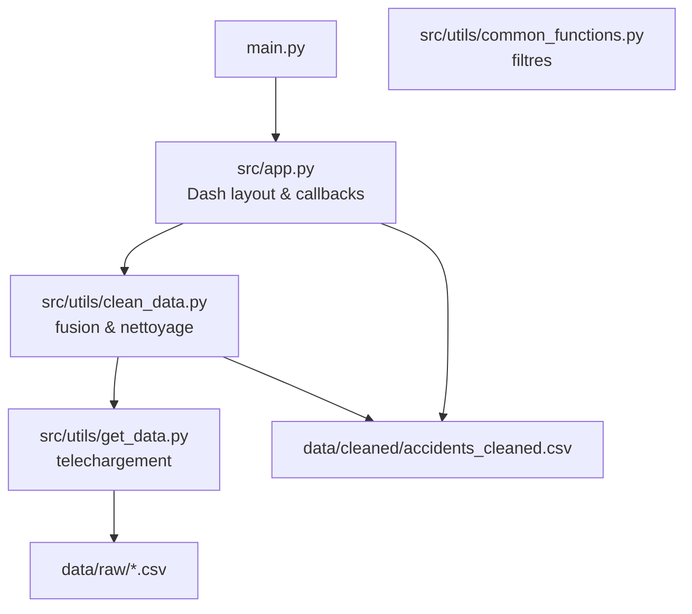

# Tableau de bord accidents routiers (France, 2022)

Ce dépôt contient un dashboard **Dash/Plotly** qui explore les accidents corporels de la circulation en France (données ouvertes du Ministère de l’Intérieur, millésime 2022).  
Il propose un histogramme de gravité croisé avec le type de zone, un histogramme par état de chaussée, une carte de densité, un graphique horaire filtrable par plage de dates et un camembert sur les conditions d’éclairage.

## User Guide
- Pré-requis : Python 3.11+.
- Installation rapide :
  ```bash
  python3 -m venv .venv
  source .venv/bin/activate
  python -m pip install -U pip
  python -m pip install -r requirements.txt
  ```
- Lancer le dashboard :
  ```bash
  python main.py
  ```
  Puis ouvrir le navigateur sur http://127.0.0.1:8050/.
- Données hors-ligne : un jeu 2022 est déjà inclus dans `data/raw/` et `data/cleaned/`. Le dashboard fonctionne sans connexion.  
  Pour rafraîchir les données (re-téléchargement depuis data.gouv.fr) :
  ```bash
  python -m src.utils.clean_data
  ```
- Vidéo : placez la démonstration dans `video.mp4` à la racine (max 3 min).

## Data
- Source principale : [Bases annuelles des accidents corporels de la circulation (data.gouv.fr)](https://www.data.gouv.fr/fr/datasets/base-de-donnees-annuelles-des-accidents-corporels-de-la-circulation/).
- Fichiers utilisés (millésime 2022) :
  - Caractéristiques : https://static.data.gouv.fr/resources/bases-de-donnees-annuelles-des-accidents-corporels-de-la-circulation-routiere-annees-de-2005-a-2021/20231005-093927/carcteristiques-2022.csv
  - Lieux : https://static.data.gouv.fr/resources/bases-de-donnees-annuelles-des-accidents-corporels-de-la-circulation-routiere-annees-de-2005-a-2021/20231005-094112/lieux-2022.csv
  - Usagers : https://static.data.gouv.fr/resources/bases-de-donnees-annuelles-des-accidents-corporels-de-la-circulation-routiere-annees-de-2005-a-2021/20231005-094229/usagers-2022.csv
- Géolocalisation : latitude/longitude présentes dans le fichier Caractéristiques.  
- Nettoyage : `src/utils/clean_data.py` fusionne les trois tables, calcule la gravité maximale par accident, normalise lat/long et les libellés (agglo, état de chaussée, éclairage).

## Developer Guide
- Architecture (imperative) :

- Ajouter une page/graphique : créer un composant Dash dans `src/app.py` ou un module dédié dans `src/components/`, puis l’inclure dans la layout et le callback principal.  
- Mise à jour des données : modifier les URLs dans `config.py`, exécuter `python -m src.utils.clean_data`.

## Rapport d'analyse
- Zones : la majorité des accidents corporels surviennent **en agglomération**, mais la part des accidents mortels reste élevée hors agglomération (voir histogramme gravité/zone).
- Route : l’**état mouillé** est la seconde situation la plus fréquente après route normale, ce qui suggère un risque accru sous la pluie.
- Temps : les pics horaires apparaissent aux heures de pointe (matin/soir). Filtrer par plage de dates permet de vérifier les variations saisonnières.
- Éclairage : le camembert montre une proportion notable d’accidents en **absence d’éclairage public** la nuit, rappelant l’importance de la visibilité.
- Spatial : la carte de densité concentre les accidents dans les grands pôles urbains et sur les axes majeurs.

## Copyright
Je déclare sur l’honneur que le code fourni a été produit par moi-même à l’exception des éléments suivants :
- N/A (aucun copier-coller de code externe).  
Toute ligne non déclarée ci-dessus est réputée être produite par l’auteur du projet.
